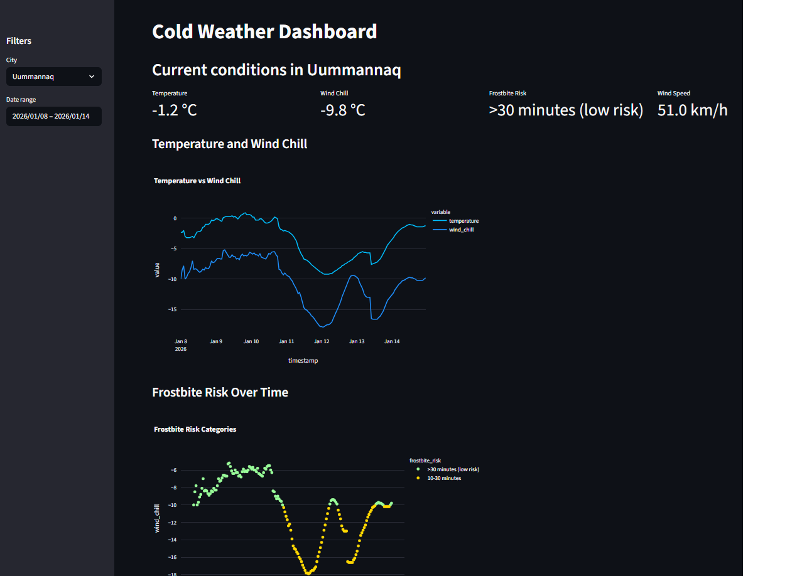
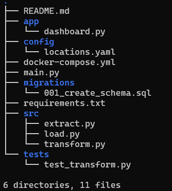

# Cold Weather ETL Pipeline
End-to-end pipeline that monitors cold-weather cities using real-time data from [Open-Meteo](https://open-meteo.com) (no API key required).

## Features
- **Calculates metrics** like [wind chill](https://en.wikipedia.org/wiki/Wind_chill), frostbite risk time and estimated snowfall.
- **Real-time weather ingestion** (hourly via the Open-Meteo API)
- **Dockerized PostgreSQL** for reproducable setup.
- **File caching** for fast reruns.
- **Interactive Streamlit dashboard** with filters and charts.

## Tech stack
- Python 3.12
- pandas, numpy
- requests (API)
- psycopg2-binary (DB)
- python-dotenv (config)
- pyyaml (locations config)
- streamlit + plotly (dashboard)
- pytest (testing)
- Docker Compose (PostgreSQL)

## Prerequisites
- *Python 3.12*
- *Docker & Docker Compose (for PostgreSQL)*
    ##Ubuntu/WSL: `sudo apt install docker.io docker-compose-plugin`
    ##Windows/macOS: Install [Docker Desktop](https://www.docker.com/products/docker-desktop)

## Setup

- Make a .env file (see `.env.example`)
- Cities can be set in `locations.yaml`

```bash
# Clone and enter
git clone https://github.com/rgb958/cold-weather-etl-pipeline.git
cd cold-weather-etl-pipeline

# Create virtual environment
python3 -m venv venv
source venv/bin/activate

# Install dependencies
pip install -r requirements.txt

# Start PostgreSQL
docker compose up -d

# Run the pipeline (ETL)
python3 main.py

#Launch dashboard
streamlit run app/dashboard.py
```
Open http://localhost:8501 in your browser to access the dashboard.

## Example dashboard


## Project structure
